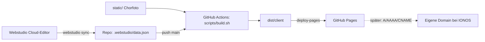

# Elua Website

Website des Männerchors Elua (Berlin). Inhalt und Design werden im [Webstudio](https://webstudio.is) Cloud-Editor gepflegt. Das Repo ist die Quelle der Live-Seite: GitHub Actions baut bei jedem Push auf `main` die statische Seite aus `.webstudio/data.json` und deployt sie auf GitHub Pages.

Live: https://skaldorhub.github.io/elua-website/

## Architektur

Wichtig: Der CI-Lauf baut **nur aus dem Repo**, nicht aus der Cloud. Eine Änderung im Cloud-Editor geht erst nach `sync`, Commit und Push live. Umgekehrt muss eine Änderung im Repo per `import` in die Cloud, bevor dort weitergearbeitet wird (siehe [workflow.md](docs/workflow.md)).

## Verzeichnisse

| Pfad | Zweck | Von Hand ändern? |
|---|---|---|
| `.webstudio/data.json` | Synchronisierter Projektstand aus der Cloud | nein, kommt aus `sync` |
| `.webstudio/config.json` | Projekt-ID (kein Secret) | nein |
| `app/`, `pages/`, `renderer/`, `vite.config.ts`, `package.json` | Von `webstudio build` erzeugt, wird bei jedem Build überschrieben | nein |
| `static/` | Dateien, die 1:1 in die Seite kopiert werden (Chorfoto) | ja |
| `design/` | Layout-Quellen (`home.jsx`, `impressum.jsx`) und alle Design-Tokens (`tokens.json`) | ja |
| `scripts/build.sh` | Build, identisch lokal und in CI | ja |
| `scripts/apply-design.py` | Spielt `design/` in einen lokalen Webstudio-Builder ein (siehe selfhost-editing.md) | ja |
| `.github/workflows/deploy.yml` | CI: build, deploy | ja |
| `docs/` | Diese Dokumentation | ja |
| `notes/` | Lokale Notizen, per `.gitignore` nicht im Git | lokal |

## Docs

- [docs/setup.md](docs/setup.md): Einrichtung für neue Mitarbeitende
- [docs/workflow.md](docs/workflow.md): Alltag, Deploy, Rollback
- [docs/content.md](docs/content.md): Inhaltsregeln, Platzhalter, Impressum und Datenschutz
- [docs/selfhost-editing.md](docs/selfhost-editing.md): Automatisiertes Bearbeiten über einen lokalen Webstudio-Builder (fortgeschritten)
- [docs/troubleshooting.md](docs/troubleshooting.md): Fehlerbilder und Lösungen
- [docs/manual-deploy.md](docs/manual-deploy.md): Deploy ohne GitHub Actions
- [docs/dns-domain.md](docs/dns-domain.md): Eigene Domain bei IONOS
