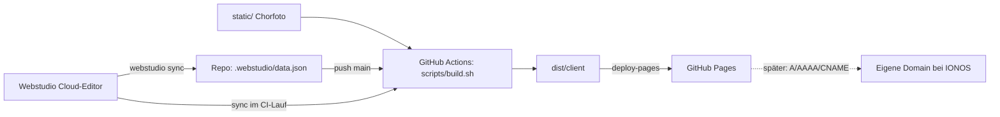

# Elua Website

Website des Herrenchors Elua (Berlin). Inhalt und Design werden im [Webstudio](https://webstudio.is) Cloud-Editor gepflegt. Dieses Repo hält eine versionierte Kopie und baut daraus die statische Seite, die per GitHub Actions auf GitHub Pages läuft.

Live: https://skaldorhub.github.io/elua-website/

## Architektur

Wichtig: Der CI-Lauf holt den Stand **direkt aus der Cloud**. Das Repo ist eine Sicherung, nicht die Quelle. Ein `git revert` der Projektdaten ändert die Live-Seite also nicht (siehe [workflow.md](docs/workflow.md), Abschnitt Rollback).

## Verzeichnisse

| Pfad | Zweck | Von Hand ändern? |
|---|---|---|
| `.webstudio/data.json` | Synchronisierter Projektstand aus der Cloud | nein, kommt aus `sync` |
| `.webstudio/config.json` | Projekt-ID (kein Secret) | nein |
| `app/`, `pages/`, `renderer/`, `vite.config.ts`, `package.json` | Von `webstudio build` erzeugt, wird bei jedem Build überschrieben | nein |
| `static/` | Dateien, die 1:1 in die Seite kopiert werden (Chorfoto) | ja |
| `design/` | JSX-Quellen des Layouts für das automatisierte Einspielen | ja |
| `scripts/build.sh` | Build, identisch lokal und in CI | ja |
| `.github/workflows/deploy.yml` | CI: sync, build, deploy | ja |
| `docs/` | Diese Dokumentation | ja |
| `notes/` | Lokale Notizen, per `.gitignore` nicht im Git | lokal |

## Docs

- [docs/setup.md](docs/setup.md): Einrichtung für neue Mitarbeitende
- [docs/workflow.md](docs/workflow.md): Alltag, Deploy, Rollback
- [docs/content.md](docs/content.md): Inhaltsregeln, Platzhalter, Impressum und Datenschutz
- [docs/selfhost-editing.md](docs/selfhost-editing.md): Automatisiertes Bearbeiten über einen lokalen Webstudio-Builder (fortgeschritten)
- [docs/troubleshooting.md](docs/troubleshooting.md): Fehlerbilder und Lösungen
- [docs/manual-deploy.md](docs/manual-deploy.md): Deploy ohne GitHub Actions
- [docs/dns-domain.md](docs/dns-domain.md): Eigene Domain bei IONOS
